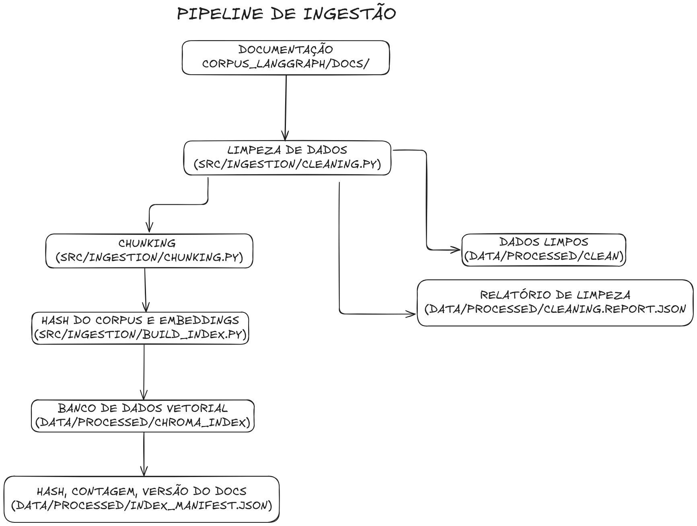
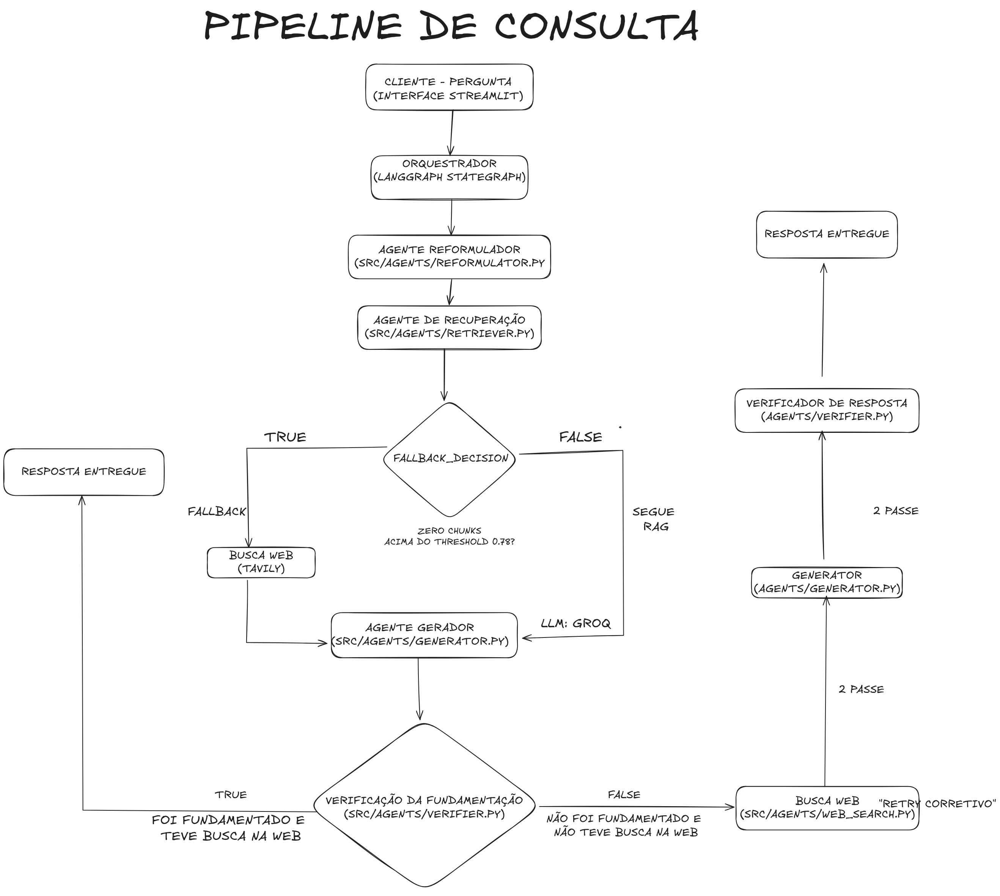

# AI Agentic system

Está se tornando uma tendência criar agentes de IA poderosos combinando vários subagentes menores. No entanto, isso também traz desafios, como reduzir alucinações, gerenciar o fluxo da conversa, monitorar o funcionamento do agente durante os testes, permitir a intervenção humana (*human-in-the-loop*) e avaliar seu desempenho. É necessário realizar muitos testes de tentativa e erro.

Neste projeto, começaremos criando cinco subagentes simples e, em seguida, construiremos um sistema multiagente que irá analisar um corpus de documento, combinando recuperação vetorial (RAG) com busca na web como fallback. Ao longo do processo, abordaremos os fundamentos, os desafios enfrentados na criação de arquiteturas complexas de agentes de IA, bem como formas de avaliá-las e aprimorá-las.

Tech Stack utilizada no projeto:
- Python
- Armazenamento de vetores: ChromaDB
- Busca Web: Tavily
- Framework de Orquestração: LangGraph
- LLM de geração: Groq (`llama-3.1-8b-instant`)
- Embeddings: `intfloat/multilingual-e5-small` (CPU)
- Interface: Streamlit

---

## Corpus escolhido: documentação do LangGraph (tag `1.0.0`)

O corpus é a documentação oficial do [LangGraph](https://github.com/langchain-ai/langgraph), congelada na tag `1.0.0` (commit `c4144bb48f97e6afeaa002de318580cc41c19893`, baixada em 06/07/2026), sob `corpus_langgraph/` — 20 arquivos Markdown, **63.954 tokens** pós-limpeza (acima do mínimo do edital, que exige 20 documentos OU 50.000 tokens). A proveniência completa está em `corpus_langgraph/MANIFEST.md`.

**Por que esse corpus:**

1. **Problema real e verificável.** É a documentação de um framework que o próprio projeto usa para se construir, o que facilita validar se as respostas geradas estão corretas — temos autoridade sobre o que é ou não verdade no corpus.
2. **RAG e busca web resolvem coisas diferentes aqui.** O RAG cobre com precisão e citação o conteúdo da versão `1.0.0`. A busca web cobre tudo que existe fora dessa janela de tempo — a LangGraph já está na versão `1.2.x` no site atual (`docs.langchain.com`). Nenhum dos dois mecanismos sozinho cobre as duas categorias de pergunta.
3. **A fronteira de fallback é real, não simulada.** O corte de versão cria uma fronteira objetiva: qualquer pergunta sobre recursos posteriores à `1.0.0` não tem resposta no corpus por construção, não porque o sistema foi artificialmente restringido.

**Onde o sistema falha, e por quê (esperado):**
- **Cobertura de conteúdo:** perguntas sobre features/versões posteriores à tag `1.0.0`, ou que exigem síntese entre seções distantes do corpus — é a fronteira deliberada do projeto.
- **Qualidade da fonte de fallback:** o sistema classifica corretamente quando uma pergunta precisa de busca web (100% de acerto no benchmark), mas a resposta final pode sair errada quando a Tavily devolve fontes pouco relevantes ou o modelo confunde detalhes entre entidades parecidas no texto-fonte (ex.: atribuição cruzada de dados entre CVEs diferentes). Isso é esperado: ao contrário do corpus RAG (limpo, determinístico, sob controle do projeto), o conteúdo web vem de uma fonte externa não curada. O agente verificador detecta os dois casos de forma reproduzível (`grounded: false`) — a rede de segurança funciona, mesmo quando a resposta final permanece incorreta, porque o loop de correção é limitado a uma tentativa por desenho (evitar latência/custo descontrolados).

Justificativa completa (4 seções exigidas pelo edital) em `corpus_langgraph/justificativa_corpus.md`.

---

## Arquitetura do sistema

O sistema é dividido em duas pipelines: **ingestão** (offline, roda uma vez por versão do corpus) e **consulta** (online, roda a cada pergunta do usuário, orquestrada como um grafo de 6 agentes via LangGraph).

### Pipeline de ingestão

Fluxo: `corpus_langgraph/docs/` (Markdown bruto) → limpeza (`src/ingestion/cleaning.py`) → chunking determinístico por tokens (`src/ingestion/chunking.py`) → embeddings com `intfloat/multilingual-e5-small` (prefixo `"passage: "`, CPU) → indexação no ChromaDB (`src/ingestion/build_index.py`).

Pontos que garantem reprodutibilidade: leitura de arquivos sempre ordenada (`sorted(rglob("*.md"))`), chunk IDs determinísticos (`f"{doc_id}_{index}"`, nunca UUID), hash sha256 do corpus limpo registrado em `data/processed/index_manifest.json` — se o corpus não mudou, o índice não é reconstruído.

### Pipeline de consulta

Fluxo (grafo LangGraph, `src/orchestration/graph.py`):

`reformulator → retriever → fallback_decision → [web_search | generator] → generator → verifier → [web_search (retry corretivo, máx. 1×) | END]`

1. **`reformulator`** — gera 2 reformulações da pergunta original via LLM (multi-query, aumenta recall).
2. **`retriever`** — busca no ChromaDB para a pergunta original + reformulações, funde os resultados por `chunk_id`.
3. **`fallback_decision`** — determinístico, sem LLM: aciona busca web se nenhum chunk fundido superar o threshold de similaridade (0.78).
4. **`web_search`** — busca na Tavily, usada tanto no fallback inicial quanto no retry corretivo.
5. **`generator`** — gera a resposta citando as fontes, com truncamento de contexto (1500 chars/chunk, 6000 chars total).
6. **`verifier`** — checagem de fundamentação (groundedness) via LLM; se a resposta do RAG não for fundamentada, aciona um retry corretivo via busca web (máx. 1 vez) — é essa etapa que pega perguntas "dentro do domínio mas fora do tempo" que o threshold de similaridade sozinho não separa.

Cada execução gera um trace JSON completo em `traces/` (schema documentado em `docs/trace_schema.md`), com latência por agente, fontes usadas, motivo do fallback e veredito de fundamentação.

---

## Decisões técnicas e trade-offs

- **Groq (`llama-3.1-8b-instant`) na nuvem em vez de Ollama/`qwen2.5:3b` local.** O hardware de desenvolvimento tem GPU com apenas 2GB de VRAM (MX450); cada execução da pipeline faz de 3 a 5 chamadas de LLM (reformulator, generator, verifier — até 2× cada se o loop corretivo disparar), o que seria lento e limitante rodando local. O edital não exige geração local — a restrição de hardware era uma recomendação de planejamento, não um requisito de avaliação. Trade-off aceito: dependência de rede e de uma `GROQ_API_KEY` (mitigado por retry com backoff exponencial em rate limit). A embedding/indexação continua 100% local em CPU, decisão independente. Detalhes completos em `docs/decisoes_tecnicas.md`.
- **Threshold de similaridade calibrado em 0.78** (`src/retrieval/_manual_check.py`), separando perguntas fora do domínio (~0.70) de perguntas do corpus (~0.82–0.87). Não separa perguntas "dentro do domínio mas fora da janela de tempo" (~0.81–0.84) — por isso o `verifier` existe como segunda linha de defesa, depois da geração.
- **Chunking:** 400 tokens por chunk, 40 de overlap, tokenizado com `tiktoken cl100k_base` como proxy do tokenizer do E5 — deixa margem sob o limite de 512 tokens do modelo de embeddings, evitando truncamento silencioso.
- **Prefixos E5 (`"query: "` / `"passage: "`)** aplicados em toda chamada ao modelo de embeddings — omiti-los não gera erro, apenas degrada a qualidade da recuperação silenciosamente.
- **Busca híbrida (BM25 + Reciprocal Rank Fusion)** está implementada em `src/retrieval/hybrid.py` mas **não integrada** ao pipeline — foi deliberadamente adiada até a calibração da recuperação densa (E5) estar concluída.

---

## Agentes (6 no total, requisito mínimo do edital: ≥3)

| Agente | Papel |
|---|---|
| `reformulator` | Gera reformulações da pergunta para melhorar o recall da busca |
| `retriever` | Busca no ChromaDB e funde resultados de múltiplas queries |
| `fallback_decision` | Decide, de forma determinística, se a busca web precisa ser acionada |
| `web_search` | Busca na web via Tavily (fallback inicial ou retry corretivo) |
| `generator` | Gera a resposta final citando as fontes usadas |
| `verifier` | Verifica se a resposta é fundamentada no contexto (groundedness) |

---

## Avaliação (benchmark)

`benchmark/qa_pairs.json` contém 20 pares de pergunta/resposta — 10 exigindo RAG e 10 exigindo fallback (incluindo uma pergunta-armadilha fora do domínio) — com split de validação/teste respeitado (o split de teste nunca é usado para calibrar thresholds ou prompts).

Última rodada no split de teste (`benchmark/results_20260714T161811.json`, 12 perguntas):

| Métrica | Valor |
|---|---|
| Similaridade semântica média | 0.94 |
| Acurácia da decisão de fallback | 100% |
| Recall do documento esperado | 100% |
| Taxa de respostas fundamentadas (grounded) | 83,3% |
| Latência média | ~27s |

O gap entre acurácia de fallback (100%) e taxa fundamentada (83,3%) é esperado e documentado: o sistema decide corretamente *quando* buscar na web, mas a qualidade da fonte externa não é controlada pelo projeto (ver seção "Corpus escolhido" acima).

Como rodar o benchmark: `python -m src.evaluation.benchmark --split test` (ou `validation`/`all`).

---

## Observabilidade

Cada execução do pipeline grava um trace JSON em `traces/`, com o schema completo documentado em `docs/trace_schema.md`: `trace_id`, pergunta original, latência total e por agente, se/por quê o fallback foi acionado, se foi o `fallback_decision` inicial ou o `verifier` (retry corretivo) quem acionou, fontes usadas e veredito de fundamentação.

---

## Como rodar a interface

1. Crie um `.env` na raiz do repositório a partir de `.env.example` e preencha `GROQ_API_KEY` e `TAVILY_API_KEY`.
2. Instale as dependências (`pip install -r requirements.txt`) e garanta que o índice já foi construído (`python -m src.ingestion.build_index`).
3. Rode `streamlit run interface/app.py` a partir da raiz do repositório.
4. A aba "Consulta" executa o pipeline multiagente ao vivo e mostra o trace completo de cada execução; "Benchmark" lê os resultados já calculados em `benchmark/`; "Sobre o Sistema" documenta o corpus e a arquitetura de agentes.

---

## Projeto desenvolvido por:

- Gustavo Teixeira Bittencourt de Oliveira — [e-mail institucional](mailto:gustavo23300008@aluno.cesupa.br)
telefone: (91)98343-9714
- Adler Augustus de Castro Mota — [e-mail institucional](mailto:adler23300004@aluno.cesupa.br)
telefone: (91)98960-4352

---
